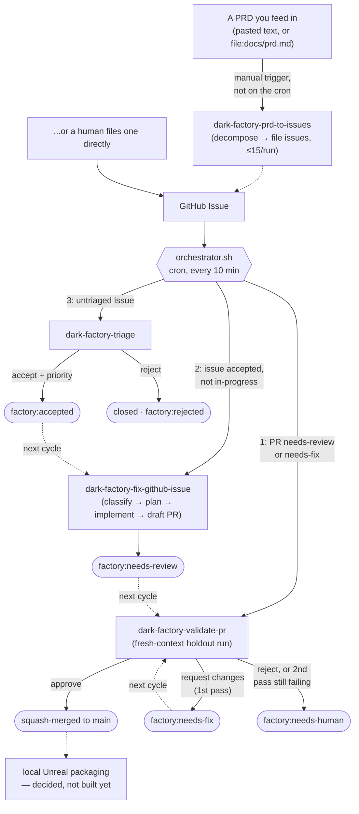
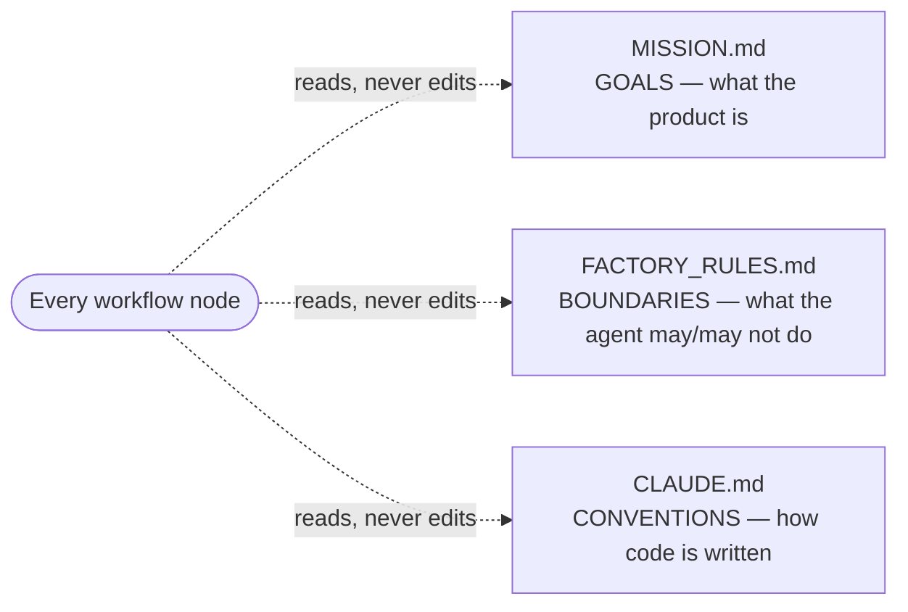

# krowd-kontrol

A [Dark Factory](https://github.com/coleam00/dark-factory-experiment) — a repo built,
reviewed, and merged almost entirely by AI coding agents, running on
[Archon](https://github.com/coleam00/archon) as the workflow harness.

**Current state: bootstrap.** The harness, governance files, and workflows are wired up
and verified end-to-end, but `MISSION.md` is still a placeholder — see `FACTORY.md` for
exactly what that means and `harness/README.md` for the validation gate's current
state. There's no app yet.

## How this works

The only human input is a GitHub issue — or a PRD, which gets mechanically decomposed
*into* GitHub issues. Everything from there — triage, implementation, review, merge —
runs as headless agent workflows dispatched by a cron script reading GitHub labels as
its only state.



Every node in the diagram is a **headless** agent run (`archon workflow run`, no chat
window) — the coding agent is the interchangeable part; the loop around it is what's
durable. Priority order (fix/validate a PR, then build an accepted issue, then triage
last) means in-flight work always finishes before new work starts. `dark-factory-prd-to-issues`
is the one node that isn't on the cron — it runs when you decide a PRD is ready, not
on a schedule, and it only *files* issues; deciding what to build stays entirely with
whoever wrote the PRD, and every issue it creates still passes through the same
`dark-factory-triage` gate as one you'd file by hand. See `docs/README.md` for the
exact invocation.

**The guidance layer** — three files every workflow reads before touching anything, one
job each, all three on the protected-files list so the factory can propose changes to
everything else but never to the rules it's judged by:



**The independence line** — the validator (`dark-factory-validate-pr`) runs in a fresh
context and only ever sees the issue + the diff, never the builder's plan, notes, or
reasoning. Some checks the builder can also run on itself; some only the validator ever
runs, and a model never decides the merge — deterministic bash does:

| Can the builder run it too? | Check | This repo |
|---|---|---|
| ✅ yes — below the line | static / unit / integration | `harness/ci.py --quick` |
| ❌ validator-only — above the line | deterministic gate | `apply-verdict` — pure bash reads a verdict file, never a model |
| ❌ validator-only — above the line | holdout scenarios | not built yet — no app to write scenarios against (`.factory/decisions.md` D-001) |
| ❌ validator-only — above the line | visual / E2E judging | wired (`agent-browser`), not live yet — same D-001 gap |

### Does this actually match the original Dark Factory pattern?

Checked component-by-component against the source video/diagrams, not just described
from memory:

| # | Component | krowd-kontrol | Status |
|---|---|---|---|
| 1 | Workflow-driven repo | 4 Archon workflows, headless agent per step, same "take a prompt, edit files, exit code" contract | ✅ live |
| 2 | The automation | `scripts/orchestrator.sh`; **identical label state machine** (`accepted → in-progress → needs-review → approved/needs-fix/needs-human`) and identical priority order (fix/check a PR → build an issue → triage last); interval is 10 min here vs. 30 in the video (deliberate choice) | ✅ live |
| 3 | Deployment | Scoped differently on purpose | ⚠️ decided, not built — a local Unreal project has no live traffic to blue/green between; "deployment" here means packaging a local build once there's real content, see `FACTORY.md` |
| 4 | Guidance layer | Same three files, same roles, same protection | ✅ live (`MISSION.md`'s *content* is still a placeholder — see `FACTORY_RULES.md` §0) |
| 5 | Validation harness | Builder/validator split, deterministic gate, independence line — all structurally in place | ⚠️ partial — deterministic gate is live; holdout + visual/E2E are wired but not yet functional, see the table above |

Two honest gaps, both already tracked (`FACTORY.md`, `.factory/decisions.md`), not
hidden: no deployment step, and the two validator-only checks that need a real running
app don't have one yet. Everything else is a faithful, verified port — read `FACTORY.md`
for the full component breakdown and `FACTORY_RULES.md` for the complete operating
rules (triage criteria, quality gates, protected files, the stop button). `MISSION.md`
will define what krowd-kontrol actually *is* once that's decided.

## Skills

`.claude/skills/` has 68 game-dev skills from
[gamedev-skills/awesome-gamedev-agent-skills](https://github.com/gamedev-skills/awesome-gamedev-agent-skills)
(Godot, Unity, Unreal, Bevy, Phaser, PixiJS, three.js, LÖVE, pygame, Roblox, plus
engine-neutral disciplines, genres, and shipping workflows), on top of `archon` and
`agent-browser`. A `router` skill auto-detects engine + task and loads only what's
relevant — you don't name skills yourself, in this session or in factory-dispatched
workflows.

```bash
npx skills update gamedev-skills/awesome-gamedev-agent-skills   # pull latest
npx skills remove gamedev-skills/awesome-gamedev-agent-skills   # uninstall
```

Also installed: `unreal-engine-cpp-pro` (UObject hygiene, GC, reflection macros, performance
patterns) from [sickn33/agentic-awesome-skills](https://github.com/sickn33/agentic-awesome-skills)
— one exact skill pulled from their 2,000+ catalog, not a bulk install. That catalog's own
maintainers warn against installing it wholesale (it includes skills flagged `critical`/
`offensive`-use-only); this one audited clean (`risk: safe`, zero command/network/credential/
filesystem/privilege signals). Pull another skill the same way, always audit first:

```bash
npx agentic-awesome-skills audit --skills <skill-id>
npx agentic-awesome-skills --path "$(pwd)/.claude/skills" --skills <skill-id>
```

**`unreal-agent-harness`** — Unreal MCP troubleshooting (`"Unable to connect"`, editor
crashes/hangs, stuck camera captures, port conflicts), the capture/QA loop, and a
Python/toolset-sandbox reference, curated from
[per-simmons/unreal-agent-harness](https://github.com/per-simmons/unreal-agent-harness)
(used with permission — that repo has no license, so this is a hand-picked subset, not
a mirror; its city-building demo content stays in the source repo).

**Prerequisite for either MCP to connect at all: WSL2 mirrored networking.** By default
WSL2's NAT mode is supposed to auto-forward `127.0.0.1` between WSL and the Windows
host — on this machine it silently didn't, and no amount of correct `.mcp.json`/firewall
config fixed it, because the failure was in WSL2's networking layer itself, not
anything app-level. Fix is `networkingMode=mirrored` in `%UserProfile%\.wslconfig`
plus **a genuine `wsl --shutdown` from a Windows-side shell** (closing a terminal window
is not enough — it reconnects to the same still-running VM). Full diagnosis and the
exact verification steps (`ip addr show eth0` should equal the Windows host's real LAN
IP, not a `172.x` NAT address) are in `CLAUDE.md`'s Environment section. Skip this and
both integrations below fail with connection-refused regardless of anything else being
right.

**Unreal MCP itself** — per Epic's [official docs](https://dev.epicgames.com/documentation/unreal-engine/unreal-mcp-in-unreal-editor),
wired up and **verified working end-to-end** against the real `KrowdKontrol.uproject`:
`ModelContextProtocol` + `AllToolsets` plugins enabled, client registered in `.mcp.json`
(this session) and `.archon/mcp/unreal.json` (factory workflow nodes) as plain HTTP at
`http://127.0.0.1:8000/mcp` — no relay process needed, once mirrored networking is
active. **The server itself isn't started** — that's a one-command manual step
(`ModelContextProtocol.StartServer` in the Editor's console) left to whoever has the
Editor open, same reasoning as Blender below. Nothing this repo's headless cron/Archon
automation can drive on its own — it's live for whoever *is* driving Unreal Editor
interactively. One real gotcha found running it for real, worth knowing before you hit
it: `StaticMeshTools.import_file` is genuinely headless (`AssetImportTask.automated =
True`, confirmed by reading the plugin's own Python source), but a source file sitting
inside `Content/` also triggers Unreal's *separate* file-watcher import dialog — that one
does need a manual click. Export/stage source files outside `Content/` and only bring
them in via `import_file`; see `unreal-agent-harness/references/troubleshooting.md`.

**`blender-mcp`** — a *live* MCP connection (not a static knowledge skill) to Blender's
own official [MCP server](https://www.blender.org/lab/mcp-server/), installed, enabled
on the Windows host's Blender 5.2, and **verified working end-to-end** (a real cube: built
in Blender via `execute_blender_code`, exported FBX with `mesh_smooth_type='FACE'` —
the default `'OFF'` triggers an Unreal import warning — imported into Unreal, placed in
the level, screenshotted, confirmed, cleaned up). Registered in `.mcp.json` (this
session) and `.archon/mcp/blender.json` (factory workflow nodes). **Not auto-started** —
Blender's own docs warn the server executes LLM-generated Python with no sandboxing, so
starting the bridge is a deliberate action, not an always-on service. See the skill for
exactly how, and for an upstream dependency-pin bug (`mcp[cli]>=1.2.0` with no upper
bound) worth knowing if you ever reinstall it.

**First connection after either is registered:** `.mcp.json` servers start out
*pending approval* — run `claude` in this repo and approve `blender`/`unreal-mcp` when
prompted (or `claude mcp list` to check status) before either shows up as usable tools.

## Contributing

Once `MISSION.md` is filled in for real: file an issue. Don't open a PR — the factory
will. Until then, every issue gets rejected with a placeholder-state reason regardless
of content — see `FACTORY_RULES.md` §0.

## Setup (one-time, this machine)

```bash
# Bun + Archon CLI (built from source — archon.diy's installer may be blocked on
# some networks; source works identically)
curl -fsSL https://bun.sh/install | bash
git clone https://github.com/coleam00/archon ~/tools/archon && cd ~/tools/archon && bun install
mkdir -p ~/.local/bin && cat > ~/.local/bin/archon <<'EOF'
#!/usr/bin/env bash
exec bun "$HOME/tools/archon/packages/cli/src/cli.ts" "$@"
EOF
chmod +x ~/.local/bin/archon

# jq (used by orchestrator.sh and several workflow nodes)
curl -fsSL -o ~/.local/bin/jq https://github.com/jqlang/jq/releases/latest/download/jq-linux-amd64
chmod +x ~/.local/bin/jq

# gh, authenticated
gh auth login

# Global Archon config — interactive session use rides your `claude` login
mkdir -p ~/.archon && echo "CLAUDE_USE_GLOBAL_AUTH=true" > ~/.archon/.env

# uv (Python) — also needed by blender-mcp below
curl -LsSf https://astral.sh/uv/install.sh | sh

# blender-mcp — see .claude/skills/blender-mcp/SKILL.md for the extension
# build/install steps (needs Blender itself, on whatever host runs it)
git clone https://projects.blender.org/lab/blender_mcp.git ~/tools/blender_mcp
cd ~/tools/blender_mcp && uv venv .venv --python 3.10
source .venv/bin/activate && uv pip install -r mcp/requirements.txt
uv pip install -e mcp && uv pip install "mcp[cli]<2.0.0"   # pin — see skill for why
cat > ~/.local/bin/blender-mcp <<'EOF'
#!/usr/bin/env bash
exec "$HOME/tools/blender_mcp/.venv/bin/blender-mcp" "$@"
EOF
chmod +x ~/.local/bin/blender-mcp
```

Verify: `archon doctor` and, from this repo, `archon validate workflows && archon validate commands`.

## Web dashboard

Archon ships a web UI — conversations, live workflow-run progress, and a
drag-and-drop workflow builder. It's **machine-level, not repo-level**: one
instance covers every Archon project registered on this machine (krowd-kontrol
included, auto-registered the first time a workflow runs against it), the same
way the CLI is.

**Always on**: a small wrapper script (`~/.local/bin/archon-ui`, not part of
this repo — it's Archon-level, not krowd-kontrol-level) starts it, and cron
keeps it up — `@reboot` for a cold machine start, plus a `*/10 * * * *` check
that's a no-op if it's already running (same self-heal pattern as
`scripts/orchestrator.sh`).

```text
http://localhost:5173
```

```bash
archon-ui status   # is it up right now
archon-ui start    # start it (safe to run if already running)
archon-ui stop     # stop both processes
```

Logs: `~/.archon/logs/archon-server.log` and `archon-web.log`. Built from
source (`~/tools/archon`), so it's the same install this whole setup already
uses — no separate download.

## Run something right now (no cron needed)

```bash
cd krowd-kontrol

archon workflow list                                              # see all 5 factory workflows + Archon's bundled defaults
archon workflow run dark-factory-triage --branch triage/$(date +%s) "Triage open issues"
archon workflow run dark-factory-fix-github-issue --branch fix/issue-42 "Fix issue #42"
archon workflow run dark-factory-validate-pr --branch validate/pr-17 "Validate PR #17"
archon workflow run dark-factory-prd-to-issues --branch prd/my-feature "file:docs/prd.md"
```

Always use `--branch` — it isolates the run in its own git worktree so it can't collide
with anything else. Long runs: add `run_in_background: true` if scripting this, or just
open a second terminal.

## Let it run itself (the cron loop)

Already installed as `*/10 * * * *` via `crontab -e`, pointed at
`scripts/orchestrator.sh`. It reads GitHub labels, dispatches in priority order (fix/validate
PRs → accepted issues → untriaged issues), and does nothing if nothing needs doing.

### Getting data in / going fully autonomous

The loop is already running on schedule — it's just currently a no-op, because `MISSION.md`
is still a placeholder (see the diagram above, and `FACTORY_RULES.md` §0). To go from
"the loop runs" to "the loop builds things with nobody watching":

1. **Fill in `MISSION.md` for real** — what krowd-kontrol is, in/out of scope, hard
   invariants. This is the one step that isn't yours-to-automate; a human decides scope.
   Delete `FACTORY_RULES.md` §0 in the same commit.
2. **Confirm the cron is active**: `crontab -l` should show the `*/10 * * * *` line.
3. **File a GitHub issue.** That's the entire "getting data in" step — every issue is a
   spec. Within 10 minutes the orchestrator triages it; if accepted, the next cycle
   builds it; the cycle after that validates and merges (or kicks it back) — no further
   input from you unless it lands on `factory:needs-human`.

**Auth — nothing to set by default.** The orchestrator rides the machine's Claude Code
subscription login (`CLAUDE_USE_GLOBAL_AUTH=true` in `~/.archon/.env`, already
configured) — the same credential interactive `archon`/`claude` use rides. No separate
Anthropic Console account, API key, or metered billing needed for unattended dispatches;
confirmed to work for headless, no-TTY invocations. Every `cron.log` line is prefixed
`Auth: subscription login (global auth)` so you can see at a glance it's still using
this path. See `.factory/decisions.md` D-002 for the tradeoff this accepts (subscription
OAuth can eventually need an interactive re-login) and how it's monitored (below).

**Optional: switch to a dedicated API key instead** — e.g. to put unattended spend on
its own bill, separate from your subscription. Get one from
[console.anthropic.com/settings/keys](https://console.anthropic.com/settings/keys),
then:

```bash
echo "CLAUDE_API_KEY=sk-ant-..." > ~/.archon/orchestrator.env
chmod 600 ~/.archon/orchestrator.env
```

This overrides global auth for cron runs only (`cron.log` switches to `Auth: dedicated
API key`) — interactive use is unaffected.

**How to check the subscription login is actually still working** — not just which mode
was selected, but whether headless auth genuinely succeeds right now:

```bash
bash scripts/check-auth.sh                            # one cheap Haiku call; AUTH_OK or AUTH_FAILED
```

You shouldn't normally need to run this yourself — `scripts/orchestrator.sh` runs it
automatically at the start of every 10-minute cycle, *before* dispatching anything, and
skips the cycle (no wasted work) if it fails. So the passive check is just:

```bash
grep "Auth check" ~/.archon/logs/krowd-kontrol/cron.log | tail -5   # should all say OK
```

A run of `Auth check FAILED` lines means the subscription login lapsed — `claude /login`
interactively to refresh it (see the full error detail logged right below each
`FAILED` line), or switch to a dedicated API key above as a workaround.

**Watch it**:

```bash
tail -f ~/.archon/logs/krowd-kontrol/cron.log        # orchestrator's own dispatch log
ls ~/.archon/logs/krowd-kontrol/                     # per-dispatch workflow logs
archon isolation list                                # active worktrees right now
```

## Stop it

Two independent kill switches, both fail closed (network down or unreadable = stopped,
never "carry on"):

```bash
touch .factory-stop                          # local, works offline, checked first
gh issue create --title x --label factory:stop   # remote, reachable from a phone
```

Remove the file / remove the label to resume. Nothing needs restarting — the next cron
tick just re-checks.

## Change what the factory does

- **Scope** (what it's allowed to build): edit `MISSION.md`.
- **Process** (triage rules, quality gates, protected files): edit `FACTORY_RULES.md`.
- **Code conventions**: edit `CLAUDE.md`.
- **The workflows themselves**: `.archon/workflows/*.yaml` + the prompts they load from
  `.archon/commands/*.md`.

All of the above are on the protected-files list — the factory can propose changes to
everything else, never to these. Edit them locally, commit, push; the next dispatch
picks it up, no restart needed.
